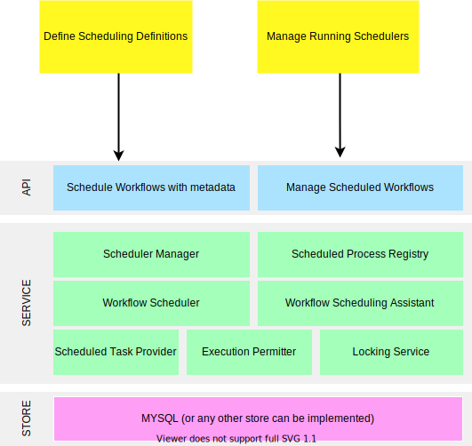

## Schedule Conductor Workflows
Schedule Conductor workflow is a _scheduler as a service_ that runs in the cloud with [Netflix conductor](https://github.com/Netflix/conductor)
embedded in it. It runs as an extension module of conductor.

### Motivation
- In digital space there are many use cases that are solved by running schedulers. Some of the common cases are:
	1. publish site map for an e-commerce website.
	2. refresh cache everyday at a fix time.
	3. send an email notification at a scheduled time, etc.
- If your architecture is micro services based then you have only two options:
	1. either to add scheduling capability (like Quartz scheduler, Spring scheduler, etc) in the service that needs to
	 schedule a task.
	2. or to setup a separate micro service, which will perform scheduling for required use cases. This service interact 
	with other service for data needs through REST APIs.
- In the end we have unnecessary mesh of schedulers. After certain point of time such kind of setup is completely out 
of control.
- Solution to the problem is _Schedule Conductor workflow_:
	- This can be deployed in place of conductor server.
	- Embedded conductor provides service orchestration capability.
	- Extension module provides scheduling capability.
	- Conductor workflow with cron expression can be scheduled through REST API.
	- Scheduled job spawned internally starts a workflow at a scheduled time.
- _Schedule Conductor workflow_ is extendable to work with all persistence stores supported by conductor.

*Quickly use able in _PRODUCTION_*:
- Scheduling module can be enabled with property `conductor.additional.modules= net.jas34.scheduledwf.config.ScheduledWfServerModule` 
- Deploy `scheduledwf-server` instead of `conductor-server`. 

You are done!

Schedule Conductor is compatible with Java 8 and has embedded Conductor v2.30.4

Architecture 
---------
### High Level Architecture

##### API
- Expose REST API interface for scheduling a workflow with metadata definition and cron expression (`Scheduled Workflow Metadata Management`)
- Expose REST API interface for managing running schedulers (`Scheduler Management`) 
- Read more about in section _Scheduling And Managing A Workflow_.

##### SERVICE
- Consists of manager to spawn a scheduler process.
- One stop to manage complete life cycle of schedulers.
- Read details in section _Component Details_. 

##### STORE
- Currently implemented for MYSQL.
- Can be extended to other persistence stores offered by conductor.
- Get more details on DAO from section _Persistence Layer_.

Getting started
--------------
- Download jar from maven central ---TBD---
- Alternatively:
	- you can fork a branch from ---Link to master TBD---
	- run ./mvnw clean install
- Executable jar can be found at `scheduledwf/scheduledwf-server/target/scheduledwf-server-{version}.jar`
- start server with command:
	`java -jar scheduledwf-server-{version}T.jar [PATH TO PROPERTY FILE] [log4j.properties file path]`
	
Scheduling And Managing A Workflow
-------------
- REST operations for scheduling can be accessed on the conductor swagger at http://{host}:{port}
- _Example_: Let us schedule sample workflow with name [testwf](scheduledwf-server/src/test/resources/testwf-def.json). 
Assuming workflow definition already exists in conductor server. You can use [Cron Maker](http://www.cronmaker.com/) to generate cron expression.	
	- From swagger use`Scheduled Workflow Metadata Management` to add/update [scheduling metadata](scheduledwf-server/src/test/resources/schedule-testwf-def.json).
		- POST /scheduling/metadata/scheduleWf: Schedule new workflow
		- GET /scheduling/metadata/scheduleWf: Get scheduling metadata of scheduled workflows.
		- GET /scheduling/metadata/scheduleWf/{name}: Get scheduling metadata of scheduled workflows by workflow name.
		- PUT /scheduling/metadata/scheduleWf/{name}: Update the status of scheduled workflow metadata.
	
	- From swagger use`Scheduler Management`:
		- to search about schedule manager running on different nodes of cluster.
		- to search about scheduled jobs based upon scheduling metadata.
		- to search about different runs of scheduled jobs at scheduled time. The detailed data returned by [IndexScheduledWfDAO](#IndexScheduledWfDAO) 

### Runtime Model

 
Component Details
----------------

### Scheduler Manager
- This component is meant to manage lifecycle of scheduled workflow.
- It takes lifecycle state decision for a scheduler with the help of scheduled jobs registry.
- It schedules the schedulers through _scheduling assistant_.
- It index the scheduling information through [IndexScheduledWfDAO](scheduledwf-core/src/main/java/net/jas34/scheduledwf/dao/IndexScheduledWfDAO.java) interface.
	##### Scheduled Jobs Registry
	- This registry act a single source of truth to know whether a particular workflow is required to be scheduled, 
	paused or deleted.
	- It can be customized by implementing [ScheduledProcessRegistry](scheduledwf-core/src/main/java/net/jas34/scheduledwf/execution/ScheduledProcessRegistry.java) interface.
	- The default implementation can be found here `net.jas34.scheduledwf.execution.DefaultScheduledProcessRegistry`.
	- It reads scheduled workflow details through [ScheduledWfExecutionDAO](#ScheduledWfExecutionDAO).

### Scheduling Assistant
- This is an abstract layer for job scheduling.
- It comes with default implementation of [DefaultWorkflowSchedulingAssistant](scheduledwf-core/src/main/java/net/jas34/scheduledwf/execution/DefaultWorkflowSchedulingAssistant.java).
- It:	
	1. creates jobs.
	2. pause jobs.
	3. delete scheduled jobs.
- It contains factory [WorkflowSchedulerFactory](scheduledwf-core/src/main/java/net/jas34/scheduledwf/scheduler/WorkflowSchedulerFactory.java) that returns an instance of [WorkflowScheduler](scheduledwf-core/src/main/java/net/jas34/scheduledwf/scheduler/WorkflowScheduler.java) interface.
- The assistant can be customized with the implementation of [WorkflowSchedulingAssistant](scheduledwf-core/src/main/java/net/jas34/scheduledwf/execution/WorkflowSchedulingAssistant.java) interface.
	##### WorkflowSchedulerFactory
	- This is core abstraction to define Scheduled process of your choice. (`WorkflowSchedulerFactory<T extends ScheduledProcess>`)
	- `ScheduledProcess` is one of the granular entity that is expected to have reference to scheduled process/thread. Currently implemented as [CronBasedScheduledProcess](scheduledwf-core/src/main/java/net/jas34/scheduledwf/scheduler/CronBasedScheduledProcess.java).
	- The default implementation can be found here [DefaultWorkflowSchedulerFactory](scheduledwf-core/src/main/java/net/jas34/scheduledwf/scheduler/DefaultWorkflowSchedulerFactory.java).
	- Currently returns [CronBasedWorkflowScheduler](scheduledwf-core/src/main/java/net/jas34/scheduledwf/scheduler/CronBasedWorkflowScheduler.java). 

### Cron Based Workflow Scheduler (Jobs Scheduling)
- The scheduling capability is completely customizable by implementing [WorkflowScheduler](scheduledwf-core/src/main/java/net/jas34/scheduledwf/scheduler/WorkflowScheduler.java) interface and by returning applicable instance from `WorkflowSchedulerFactory`.
- The default behaviour is to enable [CronBasedWorkflowScheduler](scheduledwf-core/src/main/java/net/jas34/scheduledwf/scheduler/CronBasedWorkflowScheduler.java).
- This is composed of [wisp](https://github.com/Coreoz/Wisp) scheduler. Wisp provides in memory scheduling capabilities. As a result, `CronBasedWorkflowScheduler` also schedules in memory schedulers using wisp.
- Each scheduled job is provided an instance of `Runnable` task through [ScheduledTaskProvider](scheduledwf-core/src/main/java/net/jas34/scheduledwf/scheduler/ScheduledTaskProvider.java) interface. 
	##### ScheduledTaskProvider
	- The default implementation of task provider is [DefaultScheduledTaskProvider](scheduledwf-core/src/main/java/net/jas34/scheduledwf/scheduler/DefaultScheduledTaskProvider.java).
	- It creates fully flexible and customizable task for job before scheduling through `getTask()`.
	- It performs indexing of workflow start executions through callback to [IndexExecutionDataCallback](scheduledwf-core/src/main/java/net/jas34/scheduledwf/scheduler/IndexExecutionDataCallback.java). 
	- It uses [LockingService](scheduledwf-core/src/main/java/net/jas34/scheduledwf/concurrent/LockingService.java) 
	to prevent concurrent execution of same job on more than one server at scheduled time. 

### Locking Service
- `LockingService` is composed of `LockProvider` available in conductor.
- It contains a [ExecutionPermitter](scheduledwf-core/src/main/java/net/jas34/scheduledwf/concurrent/ExecutionPermitter.java):
	1. to get execution permit for a fix period of time through `boolean issue(ScheduledTaskDef taskDef)`
	2. to return back permit after use through `void giveBack(ScheduledTaskDef taskDef)`.
	##### Execution Permitter
	- It consists of [PermitDAO](scheduledwf-core/src/main/java/net/jas34/scheduledwf/concurrent/PermitDAO.java) 
	to persist the `Permit` for a fix period in the persistence store used by `LockProvider`.
	- This is currently supported for conductor [lock mode](https://netflix.github.io/conductor/server/#setting-up-zookeeper-to-enable-distributed-locking-service):
		1. local_only
		2. redis
	- For any other type of data store, one can implement `PermitDAO`.

### Persistence Layer
- The persistence layer has been designed in a way to be completely aligned with [persistence](https://netflix.github.io/conductor/technicaldetails) architecture of conductor.
- This will be automatically enabled with conductor property `db=MYSQL`. 
- Currently it has following DAO interfaces:
	##### ScheduledWfMetadataDAO
	- This is used to persist scheduling metadata definitions of workflow through swagger operations under `Scheduled Workflow Metadata Management`
	- This has been currently implemented for MYSQL only. One can implement `ScheduledWfMetadataDAO` for any other type of persistence store.  
	##### ScheduledWfExecutionDAO
	- This is used to persist scheduling reference against scheduled workflow.
	- Currently implemented to operate in memory and we do not see any need to move to any other persistence layer.  
	##### IndexScheduledWfDAO
	- This is used to index each run of a scheduled job with many additional details like:
		- status of last execution
		- last execution time
		- next execution time
		- node on which execution has happened, etc.
	- This has been currently implemented for MYSQL only. One can implement `IndexScheduledWfDAO` for Elastic Search persistence store.

Get Support
---------
- This project is maintained by @jas34 and @sudshan as an open source application. Use github issue tracking for filing 
issues, ideas or support requests. 
- We have a wide road map to add many features to this service through various customizable hooks described above.
- In case customization is an immediate for you, feel free to open an issue in github. We will consider that as a
priority request.

Contributions
----------
- Whether it is a small documentation correction, bug fix or new features, contributions are highly appreciated. 
- Discuss new features and explore ideas with us through github issues.

License
-------
TBA